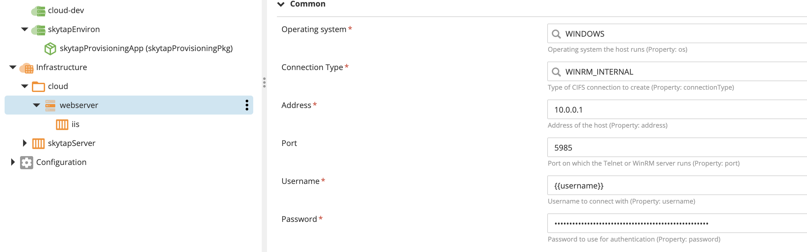
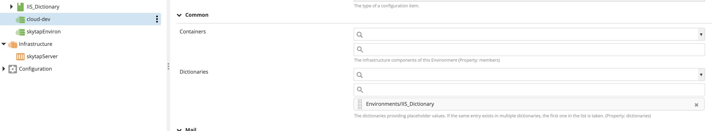

# XL Deploy Skytap Plugin v1.0.1

[![Build Status][xld-skytap-plugin-travis-image]][xld-skytap-plugin-travis-url]
[![License: MIT][xld-skytap-plugin-license-image]][xld-skytap-plugin-license-url]
![Github All Releases][xld-skytap-plugin-downloads-image]

[xld-skytap-plugin-travis-image]: https://travis-ci.org/xebialabs-community/xld-skytap-plugin.svg?branch=master
[xld-skytap-plugin-travis-url]: https://travis-ci.org/xebialabs-community/xld-skytap-plugin
[xld-skytap-plugin-license-image]: https://img.shields.io/badge/License-MIT-yellow.svg
[xld-skytap-plugin-license-url]: https://opensource.org/licenses/MIT
[xld-skytap-plugin-downloads-image]: https://img.shields.io/github/downloads/xebialabs-community/xld-skytap-plugin/total.svg

## Preface

This document describes the functionality provided by the xld-skytap-plugin.

See the [XL Deploy reference manual](https://docs.xebialabs.com/xl-deploy) for background information on XL Deploy and deployment automation concepts.

## Overview
This plugin makes it possible to create two new CI types: a server of type skytap.Server and a provisioning package of type skytap.EnvironmentSpec. When deployed, the provisioning package performs a number of steps that create the necessary infrastructure within XL Deploy to make it possible to deply applications to Skytap Virtual Machines.

## What the skytap.EnvironmentSpec does
Although created in XL Deploy within the 'Applications' heading and deployed to an XL Deploy environment configured with a Skytap Server container, the skytap.EnvironmentSpec is a Provisioning Package rather than an Application. The skytap.EnvironmentSpec is configured with a Skytap Template ID and an optional Skytap Project ID.

Before creating a skytap.EnvironmentSpec Provisioning Package, you will need to create the following (details and screenshots can be found in the Usage Section of this document):

1. Within Skytap, create a Skytap Template and add to the template a Metadata Note for every Skytap VM that XL Deploy will need to interact with. An example of this would be a VM that represents an IIS server to which XL Deploy will need to deploy applications. There are instructions for creating and adding Metadata notes to the Skytap Template later in this document.
2. A skytap.Server CI - This is created within the XL Deploy Infrastructure Heading and contains the Skytap url and login credentials.
3. An XL Deploy Environment to which the skytap.EnvironmentSpec Provisioning Package will be deployed. This environment must have the skytap.Server CI listed as a member container. In the rest of this document we will refer to this environment as the XL Deploy Provisioning Package Environment.
4. An XL Deploy Environment that will serve to hold new infrastructure items the Provisioning Package will create. These new infrastructure items represent the Skytap Virtual Machines. Future deployments of actual applications will be deployed to this environment. This environment can be configured to contain XL Deploy Dictionaries, if so desired. In the rest of this document we will refer to this as the XL Deploy Virtual Machine Environment.

The skytap.EnvironmentSpec Provisioning Package is then created within XL Deploy under the "Applications" heading. When you configure the skytap.EnvironmentSpec, you must enter the Skytap Template ID and optionally, the Skytap Project ID.

Upon deployment of the skytap.EnvironmentSpec into the XL Deploy Provisioning Package Environment, the plugin will perform the following steps:

1. Using the Skytap template and optional Skytap project IDs, the skytap.EnvironmentSpec will create, within Skytap, a new Skytap Environment based upon the Skytap Template.
2. The new Skytap Environment will be started.
3. The skytap.EnvironmentSpec will wait for the Skytap Environment to enter a 'running' state.
4. The skytap.EnvironmentSpec will parse the JSON definition of the Skytap Environment and perform the following steps:
   1. The Skytap Environment ID will be retrieved and saved into the ID property. This information will be used when the provisioning package is undeployed.
   2. The Public IP and Hostname properties will be set to the first listed Skytap VM ip and hostname properties (if these properties exist). This information is for display purposes only.
   3. The Skytap JSON will be parsed and every VM listing will be inspected to see if there is a Metadata Note.
   4. Only one Metadata Note per VM will be processed.
   5. If a VM note containing Metadata is discovered, the following steps are performed:
      1. Based upon the note's contents, XL Deploy Infrastructure CIs are created within XL Deploy and those Infrastructure CIs are added as containers into the XL Deploy Virtual Machine Environment.
      2. The metadata note is saved and will be used in the provisioning package undeploy process.
5. Upon successful deployment, the skytap.EnvironmentSpec will have started a Skytap Environment and created the needed XL Deploy infrastructure so that future XL Deploy deployment tasks can deploy applications to the Skytap Environment Virtual Machines.

Upon undeployment, the skytap.EnvironmentSpec will perform the following step:

1. The infrastructure items created in the deploy process are deleted. The metadata note JSON that was saved during deployment is used to drive the deletion process. The pre-existing XL Deploy Provisioning Package Environment is NOT destroyed. The pre-existing XL Deploy Virtual Machine Environment is NOT destroyed.
2. The Skytap Environment that was created and started on Skytap during deployment, IS destroyed.

## Requirements

Along with the xld-skytap-plugin, other plugins, needed to create the infrastructure items the skytap plugin will create, must be installed in XL Deploy. An example of such a plugin would the IIS plugin used to create IIS Server CI types.

Note:  XLD or XLR version should not be lower than lowest supported version.  See <https://support.xebialabs.com/hc/en-us/articles/115003299946-Supported-XebiaLabs-product-versions>.

## Installation

* Copy the latest JAR file from the [releases page](https://github.com/xebialabs-community/xld-skytap-plugin/releases) into the `XL_DEPLOY|RELEASE_SERVER/plugins` directory.
* Restart the XL Deploy server.

## Usage

### Prerequisites to Configuring the Skytap Provisioning Package

#### Get the ID for your Skytap Template

Within Skytap, click on the template to display it. Note the number within the browser url that follows https://cloud.skytap.com/templates/&lt;ID Number is here&gt;


#### Add Metadata Note to Template VM

Information about creating the Metadata Note can be found at the end of this document.
Within Skytap, click on the template to display it. Then, click on the VM in the list you wish to add the note to. Notes must be added to the template at the VM level, not at the Template level. You can be assured you are viewing and configuring a VM by observing that 'vms' is in the browser url.

Click the 'Leave A Note' link, paste the Metadata note into the text area then click 'Post The Note' to save.


#### Create a Skytap Server

Within XL Deploy create a Skytap Server under the Infrastructure heading. Note: The option to create a CI of type skytap.Server will only be available if you have added the xld-skytap-plugin to your XL Deploy installation. Configure the Server with the Skytap REST API Url, your skytap username and skytap password or API Security Token.


### Configuring the Skytap Provisioning Package - skytap.EnvironmentSpec

#### Create an XL Deploy Environment - Provisioning Package

Create an XL Deploy Environment to which the skytap.EnvironmentSpec Provisioning Package will be deployed. Add the skytap.Server you created as a member container.


### Create an XL Deploy Environment - Virtual Machines

Create an XL Deploy Environment to which the dynamically created Skytap Virtual Machine CIs will be dynamically added as member containers. Manually add a Dictionary to this Environment as well, if needed.


#### Create the skytap.EnvironmentSpec Provisioning Package

1. Create a new XL Deploy Application.
2. Under the new Application, create a new Provisioning Package
3. Under the new Provisioning Package, create a new skytap.EnvironmentSpec. Be sure to enter the Skytap Template ID and Project ID (if your template exists within a Skytap Project) 


## Deploying the Skytap Provisioning Package

1. Click the ellipsis next to the Skytap Provisioning Package you created and choose Deploy.
2. Deploy to the XL Deploy Environment you created that includes the Skytap Server as a member container (XL Deploy Provisioning Package Environment).
3. Click 'Continue'
4. Click 'Deploy'
5. Click 'Finish'


Upon successful deployment you should see the following:

1. All deployment steps successfully executed
2. The provisioning package shows up as deployed to the XL Deploy Provisioning Package Environment
3. The Infrastructure items configured in the Metadata Note have been created within XL Deploy
4. Those Infrastructure items have been configured with the correct values
5. Those Infrastructure items have been added to the XL Deploy Virtual Machine Environment. This makes those infrastructure CIs available for future Application Deployments within XL Deploy
6. Log into Skytap and you will see that the Skytap environment has been dynamically created and is in a running state.





## Undeploying the Skytap Provisioning Package

1. In the XL Deploy Explorer Menu, find the XL Deploy Environment where the Provisioning Package skytap.EnvironmentSpec was deployed.
2. Expand the listing, click the ellipsis and choose Undeploy. Click Undeploy then click Finish.


Upon successful undeployment, you should see the following:

1. The Provisioning Package is no longer listed as deployed in the XL Deploy environment.
2. The dynamically created Infrastructure items have been deleted and are no longer listed as member containers in the XL Deploy Environment that was set up for the Skytap Virtual Machines. Note: you may need to close and then reopen the environment page in order to update the display.
3. When you log into Skytap, you will see that the dynamically created Skytap Environment has been deleted.




## Creating the Metadata Note

Note: A website such as [jsonformatter.org](https://jsonformatter.org/) is useful for viewing, validating, formatting, and minifying JSON that does not contain sensitive information.

The skytap.EnvironmentSpec Provisioning Package's dynamic creation of Infrastructure items and environment provisioning is driven by the information contained in the Metadata Note. This information must be manually added to the Skytap Template, as a Note at the VM level. Create a single Metadata Note for every VM that runs middleware to which XL Deploy must deploy applications. The note is retrieved and processed when the skytap.EnvironmentSpec Provisioning Package is deployed within XL Deploy. An example Metadata Note is shown below:

```json
{
  "Metadata": {
    "XLD::VariableMappings": {
      "Address": "interfaces_0_ip"
    },
    "XLD::Infrastructure": [
      {
        "id": "cloud",
        "type": "core.Directory"
      },
      {
        "id": "cloud/webserver",
        "type": "overthere.SmbHost",
        "os": "WINDOWS",
        "connectionType": "WINRM_INTERNAL",
        "address": "{Address}",
        "port": "5985",
        "username": "{{username}}",
        "password": "{{my.password}}"
      },
      {
        "id": "cloud/webserver/iis",
        "type": "iis.Server"
      }
    ],
    "XLD::Environments": [
      {
        "id": "cloud-dev",
        "type": "udm.Environment",
        "members": [
          {
            "ci ref": "Infrastructure/cloud/webserver/iis"
          }
        ]
      }
    ]
  }
}
```

1. The Metadata Note information must be in valid JSON format.
2. 'Metadata' must be the enclosing node.
3. The are three allowed types within Metadata
   1. "XLD::VariableMappings"
      1. Information in this node will be used to resolve any variables in the note that are surrounded by single curly braces. The name of the node is the name of the variable as it appears in the note. The text value of the node is a path that will be used to inspect the Skytap Environment JSON description of this Skytap VM to find the string replacement value for the variable. 
      2. In the above example, the VM description from Skytap will be inspected to in find the value of the ip node of the first [0] node in the interfaces list node. The variable {Address} will then be replaced with the ip Address found at this path location in the Skytap Environment VM description.
   2. "XLD::Infrastructure"
      1. Information in this node will be used to create CIs within XL Deploy Infrastructure.
      2. In the example above, a directory named cloud will be created, within that directory, an overthere host will be created, and within the overthere host, an IIS server will be defined.
      3. Note that the id properties for these CIs do not have the word 'Infrastructure' proceeding their name.
   3. "XLD::Environments"
      1. Information in this node will be used to add a newly created Infrastructure CI to a pre-existing XL Deploy Environment
      2. In the example above, the newly created "Infrastructure/cloud/webserver/iis" (which represents an IIS server), is added to a pre-existing XL Deploy environment named 'cloud-dev'.
4. There are two types of variables that can be used within the note:
   1. Enclosed with single curly braces, such as {Address}. This type of variable will be resolved when the Provisioning Package is deployed using the rules defined in the Metadata Note.
   2. Enclosed with double curly braces, such as {{username}}. This type of variable will be resolved by the XL Deploy Dictionary feature.
5. Before adding a Metadata Note to a Skytap Template VM, you can minify the JSON. Below is screenshot of a note that has been successfully add to a Skytap Template VM. It is important that the Note be added at the VM level, not the Template level.


### Tips for construction the Metadata Note

#### Determining the JSON paths for VariableMappings

```json
"XLD::VariableMappings": {
      "Address": "interfaces_0_ip"
    }
```

1. The path should point to a value in the Skytap Environment JSON description for the VM. To view the Skytap Environment JSON description for the VM:
   1. Log into Skytap
   2. View the Template and then view the specific VM display page
   3. Append .json to the browser URL and refresh the page
   4. You should see the JSON description of this VM
   5. Identify the path to the value you want to use
   6. Create a path string for the XLD::VariableMappings section of the Metadata Note by separating the path elements with underscores

#### Creating the XLD::Infrastructure Section

```json
"XLD::Infrastructure": [
      {
        "id": "cloud",
        "type": "core.Directory"
      },
      {
        "id": "cloud/webserver",
        "type": "overthere.SmbHost",
        "os": "WINDOWS",
        "connectionType": "WINRM_INTERNAL",
        "address": "{Address}",
        "port": "5985",
        "username": "{{username}}",
        "password": "{{my.password}}"
      },
      {
        "id": "cloud/webserver/iis",
        "type": "iis.Server"
      }
    ]
```

1. It is useful to create test infrastructure setups (which you will later delete) within XL Deploy to see decide which properties/values need to be set in the XLD::Infrastructure section. All entries must have a type and an ID (name) but other properties are type dependent. You only need to set required properties and those properties you wish to configure within the XLD::Infrastructure section.
2. The screenshot below shows an infrastructure CI of type overthere.SmbHost that resides in a core.Directory within XL Deploy. The Metadata Note used to create this is displayed above. Note the following:
   1. The cloud directory needs to be created first.
   2. The "id" property corresponds to the ID property shown in the screenshot, minus the "Infrastructure/" part of the ID
   3. The "type" property corresponds to the Type shown in the screenshot
   4. The other properties in the "Common" section are user configurable and so are included in the XLD::Infrastructure Metadata Note. The property names in the Metadata Note correspond to the "Property:&lt;value&gt;" displayed in gray under the entry boxes.
   5. Some of the property values are known but others need to be dynamically populated. Note that the value for the "address" property is a variable name surrounded by single curly braces. This syntax indicates that this varible will be retrieved during the skytap.EnvironmentSpec Provisioning Package deployment, using the retrieval rule defined in the XLD::VariableMappings of the Metadata Note. The other variables defined in the XLD::Infrastructure section, such as the "username" and "password" properties are surrounded by double curly braces indicating that they will be populated by the XL Deploy Dictionary mechanism. XL Deploy will use the Dictionary that is associated with the XL Deploy Environment to which these Infrastructure items will be added.

#### Creating the XLD::Environments Section

```json
"XLD::Environments": [
      {
        "id": "cloud-dev",
        "type": "udm.Environment",
        "members": [
          {
            "ci ref": "Infrastructure/cloud/webserver/iis"
          }
        ]
      }
    ]
```

1. The XLD::Environments section is used to add the newly created Infrastructure items to a pre-existing XL Deploy Environment. This is the Environment that was created in the "Prerequisites" section of this document and refered to as the "XL Deploy Virtual Machine Environment". In the above case, the section has been configured to add the newly created IIS server to the pre-existing "cloud-dev" XL Deploy Environment. NOTE: the "ci ref" property value must be the full ID of the infrastructure item, including the prefix "Infrastructure/"

## References

[Skytap REST API](https://help.skytap.com/api.html)

[jsonformatter.org](https://jsonformatter.org/)
